# 🚕 CabsEz - Smart Cab Booking App

CabsEz is a sleek and intuitive MERN web-app Fully responsive designed for hassle-free cab booking. From real-time ride tracking to seamless payments, we've got it all covered. Below is a walkthrough of our app's key screens.

---

## 📸 App Screenshots Walkthrough

### 1. 🏁 Splash Screen
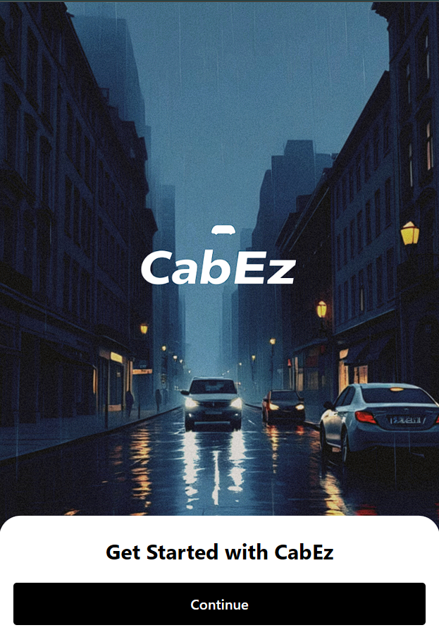

### 2. 🔐 Login Screen
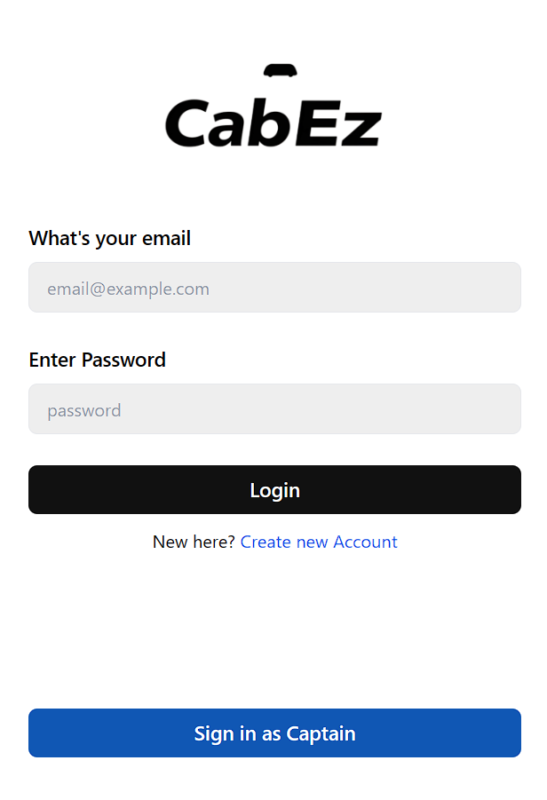

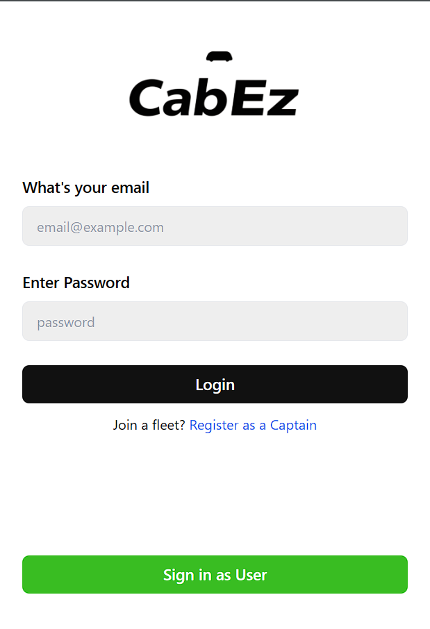

### 3. 🏠 sign up
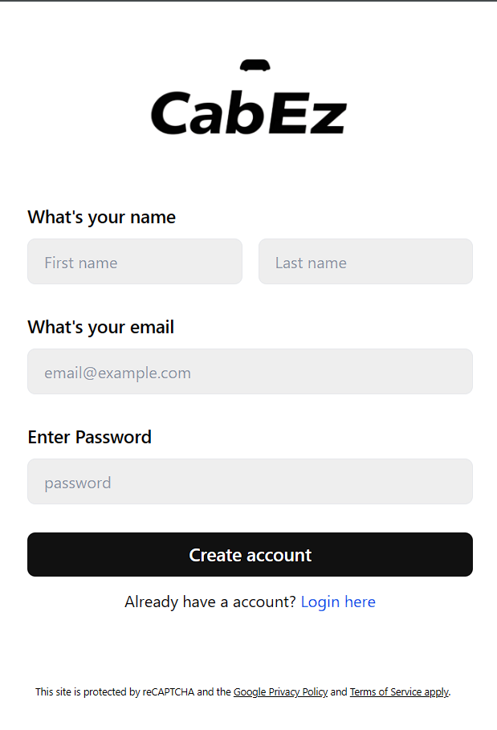

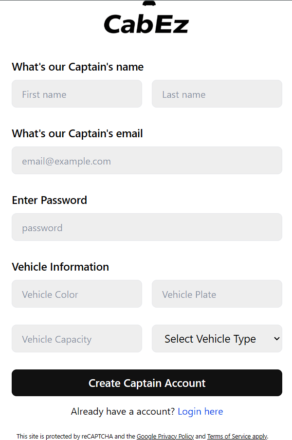

### 4. 🗺️ Map View
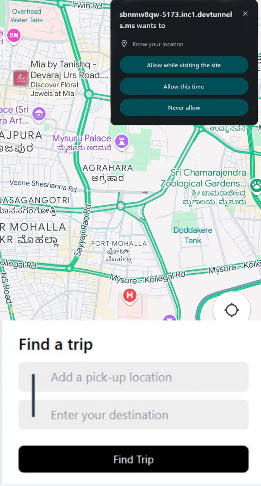

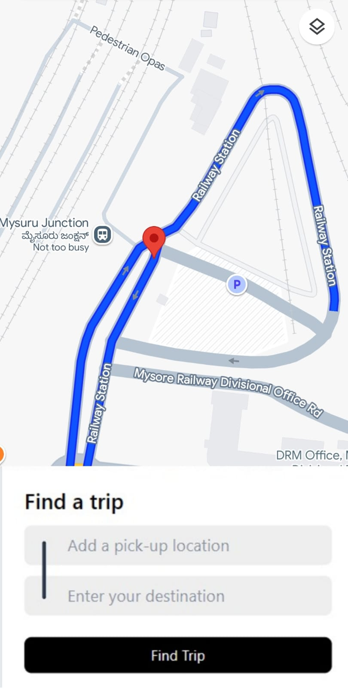

### 5. 🚗 Ride Selection
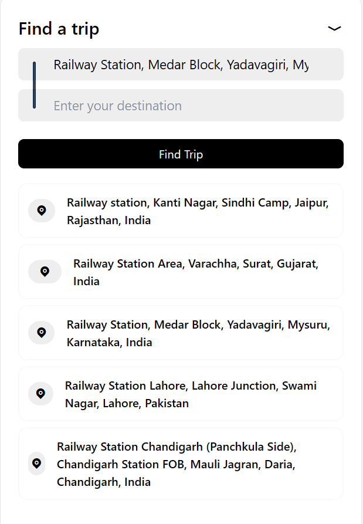

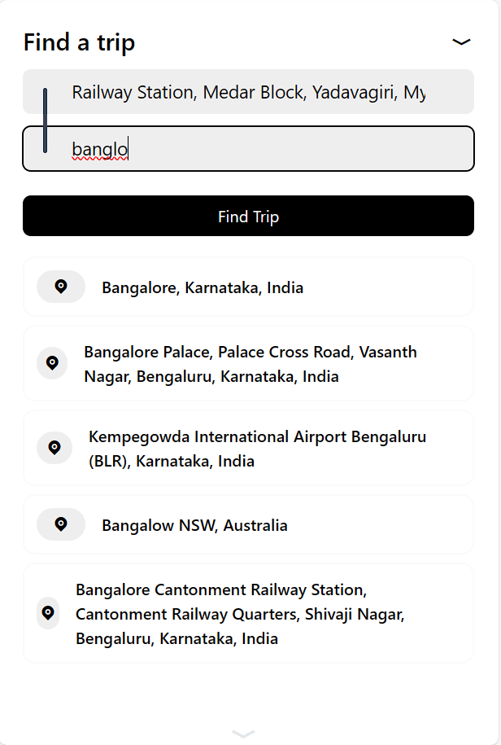

### 6. ⏱️ Live Ride Tracking
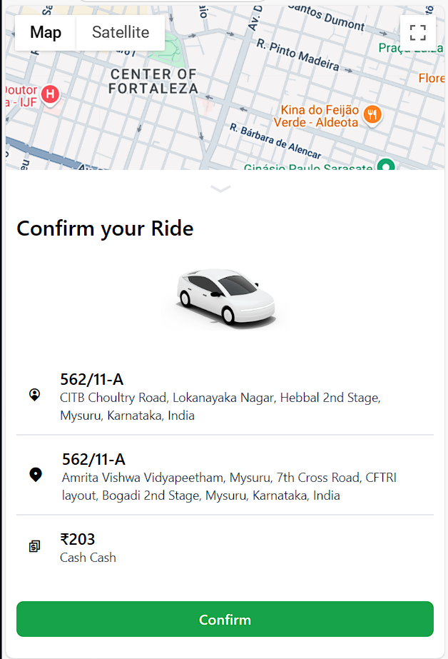

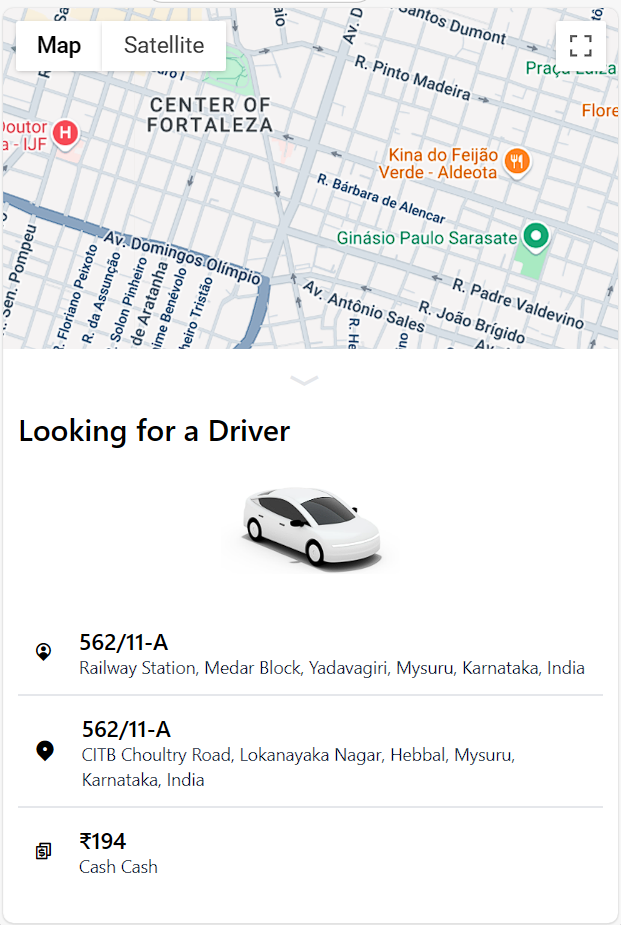

### 7. 🌟 Ride Avilable
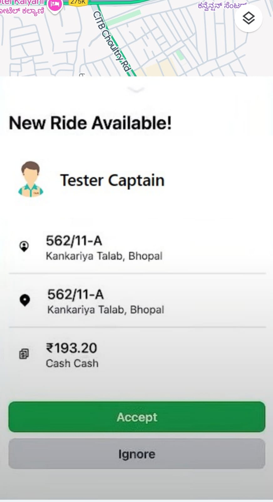

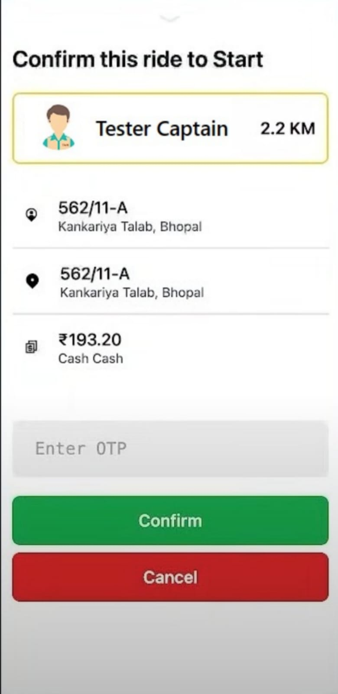

### 8. 💵 payment
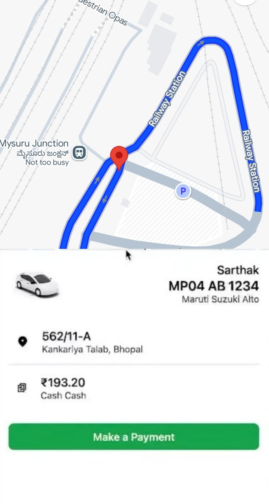

### 9. ✅ Ride Completion
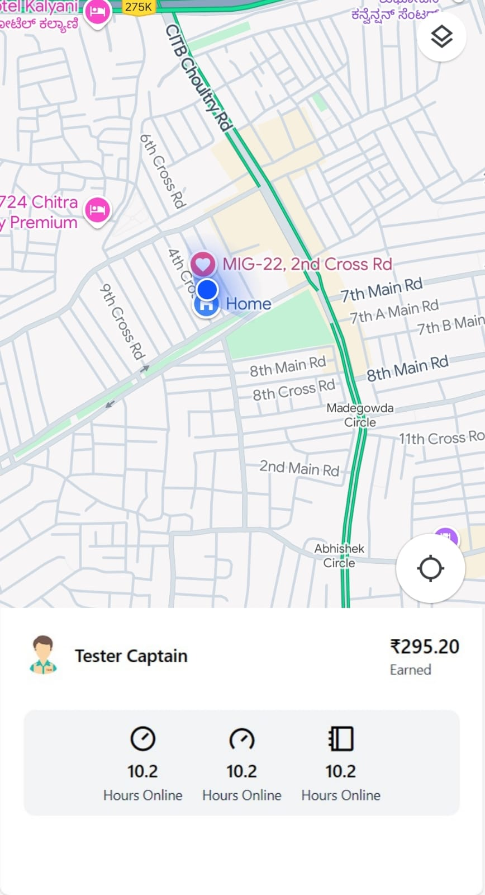
---

## 🛠️ Tech Stack

- **Frontend:** React, Tailwind CSS
- **Backend:** Node.js + Express
- **Database:** MongoDB 
- **APIs:** Google Maps, Socket-io

---

## 🚀 Features

- Real-time cab booking
- Fare estimation
- Google Maps Api
- Live tracking
- Secure payment
- cors
- CURD operations

---

## 📦 Installation

```bash
git clone https://github.com/AbiNash1017/CabsEz
cd CabsEz
CabsEz\Frontend\ npm install
CabsEz\Frontend\npm run dev
cd CabsEz\backend\ npm install
CabsEz\backend\ npx nodemon


